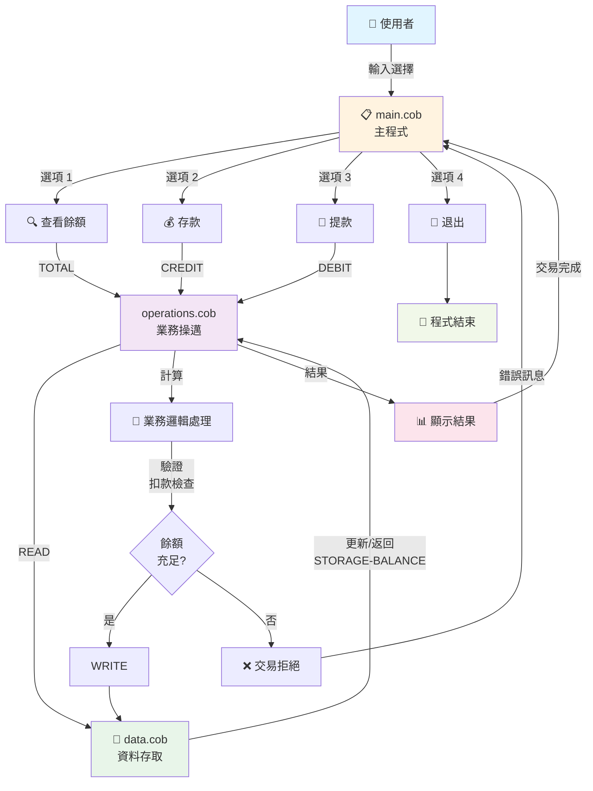
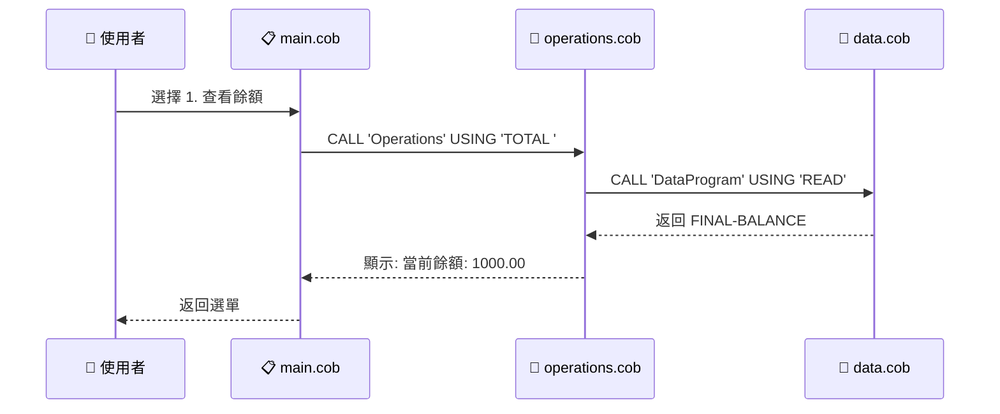
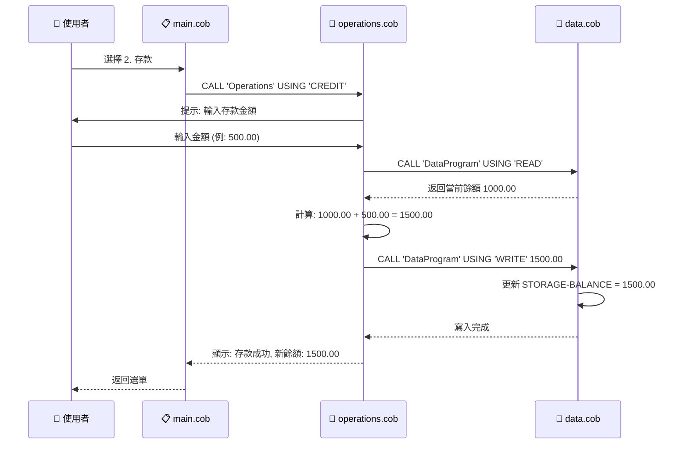
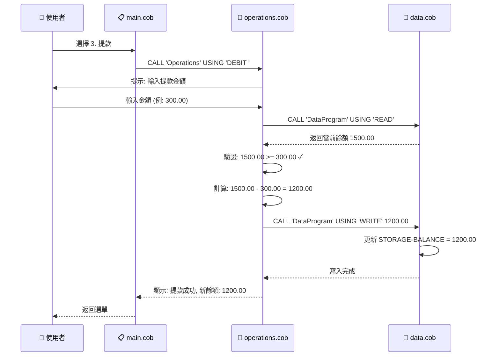
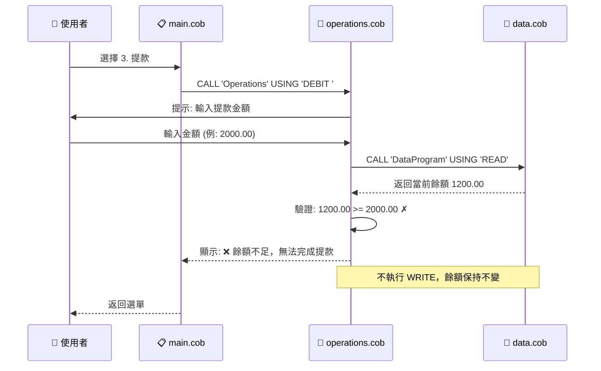
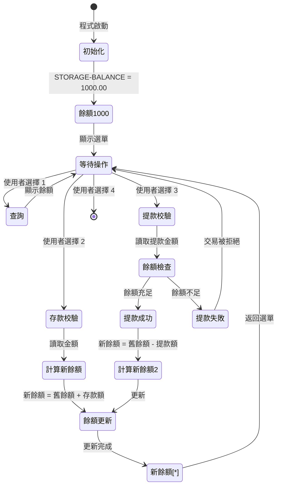

# COBOL 舊系統文檔

## 系統概述

這是一個使用 COBOL 編寫的學生帳戶管理系統，提供基本的帳戶餘額查詢、存款（入帳）和提款（扣款）功能。系統採用模組化設計，由三個主要程式組成。

---

## 程式檔案說明

### 1. main.cob - 主程式

**用途：**  
系統的主要入口點，負責使用者介面和操作流程控制。

**關鍵功能：**
- 顯示互動式選單介面
- 接收使用者的操作選擇（1-4）
- 根據使用者選擇調用對應的操作模組
- 控制程式的執行循環，直到使用者選擇退出

**操作選項：**
1. **查看餘額** - 調用 Operations 程式顯示當前帳戶餘額
2. **入帳（存款）** - 調用 Operations 程式處理存款操作
3. **扣款（提款）** - 調用 Operations 程式處理提款操作
4. **退出系統** - 終止程式執行

**業務規則：**
- 使用者必須輸入 1-4 之間的數字
- 無效輸入會顯示錯誤訊息並重新顯示選單
- 程式持續運行直到使用者明確選擇退出

---

### 2. operations.cob - 業務邏輯處理程式

**用途：**  
處理所有與學生帳戶相關的業務操作邏輯，是系統的核心業務層。

**關鍵功能：**

#### 查詢餘額 (TOTAL)
- 從資料層讀取當前帳戶餘額
- 在螢幕上顯示當前餘額

#### 入帳操作 (CREDIT)
- 提示使用者輸入存款金額
- 讀取當前餘額
- 將存款金額加到當前餘額
- 將更新後的餘額寫回資料層
- 顯示交易成功訊息和新餘額

#### 扣款操作 (DEBIT)
- 提示使用者輸入提款金額
- 讀取當前餘額
- 驗證帳戶餘額是否足夠
- 如果餘額充足：
  - 從當前餘額扣除提款金額
  - 將更新後的餘額寫回資料層
  - 顯示交易成功訊息和新餘額
- 如果餘額不足：
  - 顯示「餘額不足」錯誤訊息
  - 不執行扣款操作

**業務規則：**
- **餘額驗證**：扣款前必須檢查帳戶餘額是否足夠
- **交易原子性**：每次操作都包含讀取、計算和寫入三個步驟
- **資料一致性**：所有餘額變更都必須通過資料層進行
- **防止透支**：系統不允許帳戶餘額變成負數

---

### 3. data.cob - 資料存取層

**用途：**  
提供帳戶餘額資料的存儲和存取功能，作為系統的資料持久層。

**關鍵功能：**

#### 讀取操作 (READ)
- 將儲存的帳戶餘額傳回給調用程式
- 用於查詢當前餘額或在交易前取得最新餘額

#### 寫入操作 (WRITE)
- 接收新的帳戶餘額並更新內部儲存
- 用於在交易完成後保存新餘額

**資料結構：**
- `STORAGE-BALANCE`：持久化儲存的帳戶餘額
- 預設初始值：1000.00（新帳戶的起始餘額）
- 資料型別：PIC 9(6)V99（最多 6 位整數 + 2 位小數，範圍：0.00 - 999999.99）

**業務規則：**
- **初始餘額**：所有新學生帳戶的初始餘額設定為 1000.00
- **餘額上限**：最大餘額為 999,999.99
- **精確度**：所有金額計算保留兩位小數
- **資料封裝**：所有餘額存取必須通過此程式的 READ/WRITE 介面

---

## 系統架構

```
┌─────────────────┐
│   main.cob      │ ← 使用者介面層
│  (主程式)        │
└────────┬────────┘
         │ CALL
         ↓
┌─────────────────┐
│ operations.cob  │ ← 業務邏輯層
│  (業務處理)      │
└────────┬────────┘
         │ CALL
         ↓
┌─────────────────┐
│   data.cob      │ ← 資料存取層
│  (資料管理)      │
└─────────────────┘
```

---

## 學生帳戶業務規則總結

1. **帳戶初始化**
   - 每個學生帳戶創建時自動獲得 1000.00 的初始餘額

2. **餘額限制**
   - 最小餘額：0.00（不允許負數/透支）
   - 最大餘額：999,999.99

3. **交易規則**
   - 存款：無限制，任何正數金額都可以存入
   - 提款：必須確保餘額充足，否則交易被拒絕
   - 所有金額以兩位小數計算

4. **資料完整性**
   - 每次交易都是讀取-計算-寫入的完整流程
   - 餘額只能通過 operations 模組進行修改
   - 資料存取統一通過 data 模組進行

5. **使用者介面**
   - 提供清晰的選單導航
   - 所有操作都有即時回饋
   - 錯誤情況會顯示明確的提示訊息

---

## 技術規格

- **程式語言**：COBOL
- **資料型別**：PIC 9(6)V99（金額）、PIC X（文字）、PIC 9（數字選項）
- **模組通訊**：使用 CALL 語句進行程式間調用
- **參數傳遞**：使用 USING 子句傳遞參數
- **控制流程**：PERFORM UNTIL、EVALUATE、IF-ELSE

---

## 未來現代化建議

1. **資料持久化**：目前餘額僅儲存在記憶體中，建議連接資料庫
2. **多帳戶支援**：擴展為支援多個學生帳戶的管理
3. **交易記錄**：增加交易歷史記錄功能
4. **安全性**：增加身份驗證和授權機制
5. **報表功能**：提供帳戶報表和統計資訊
6. **錯誤處理**：增強錯誤處理和異常管理機制

---

## 資料流程圖

### 完整系統流程



### 查看餘額流程 (TOTAL)



### 存款流程 (CREDIT)



### 提款流程 (DEBIT) - 成功案例



### 提款流程 (DEBIT) - 餘額不足案例



### 資料狀態轉換圖


