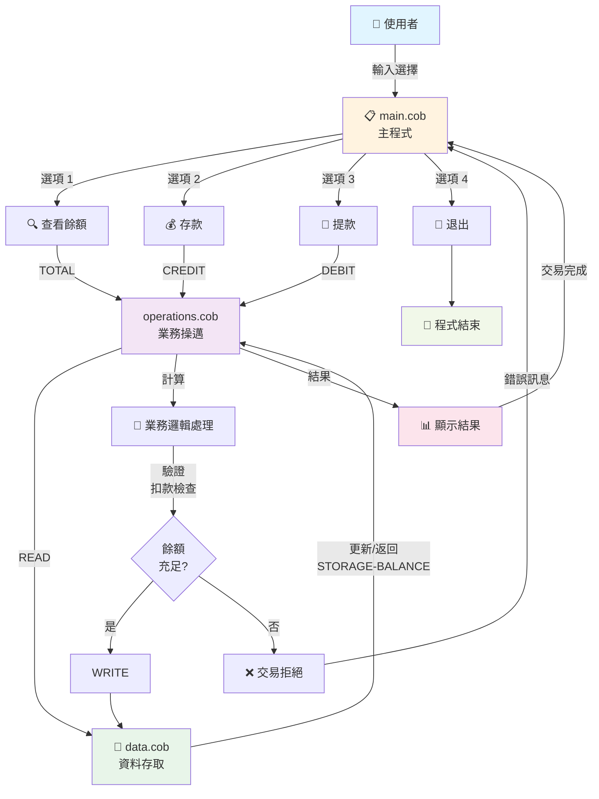
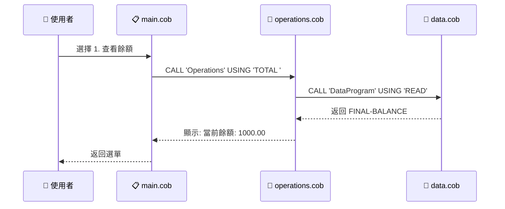
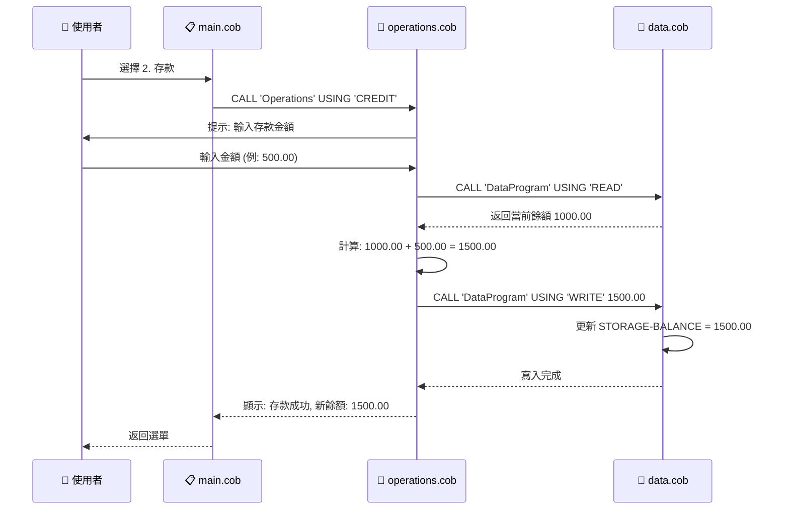
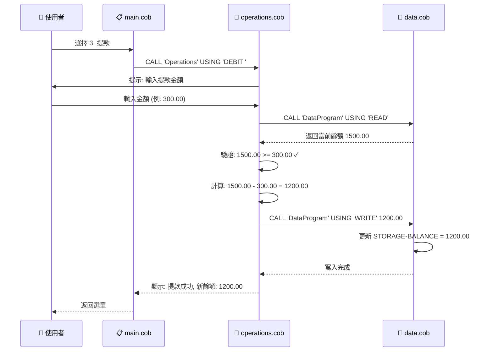
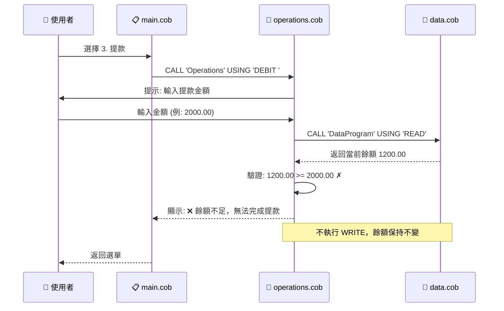
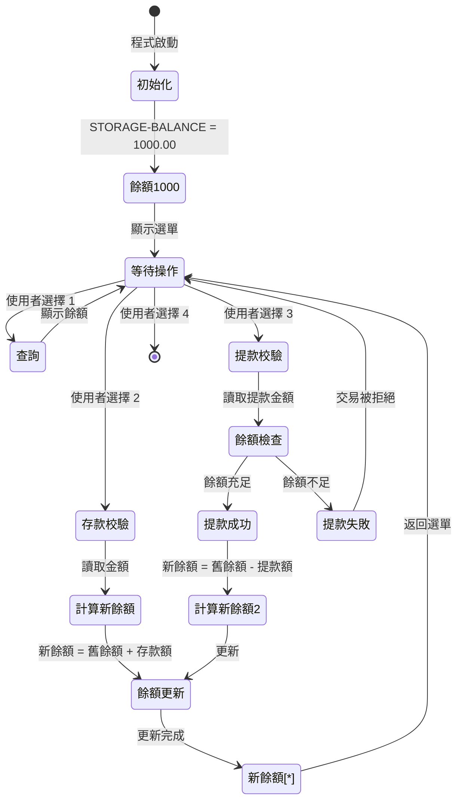

# COBOL 舊系統文檔 → Node.js 現代化實作

## 系統概述

這是一個原本以 COBOL 編寫的學生帳戶管理系統，現已現代化為 Node.js 應用程式。系統提供基本的帳戶餘額查詢、存款（入帳）和提款（扣款）功能，採用模組化設計。

### 舊系統 (COBOL) vs 新系統 (Node.js)

| 面向 | COBOL 原系統 | Node.js 現代化版本 |
|---|---|---|
| **程式語言** | COBOL | JavaScript (Node.js) |
| **架構** | 三個獨立程式 (main.cob, operations.cob, data.cob) | 單一 library (`AccountManager.js`) + CLI (`MainProgram`) |
| **業務邏輯** | 分散在 operations.cob | 統一在 `AccountManager.js` |
| **UI層** | main.cob 內的菜單邏輯 | `MainProgram` 類 (index.js) |
| **資料層** | data.cob 中的記憶體儲存 | `AccountManager.balance` 屬性 |
| **重用性** | 需要編譯並 CALL 其他程式 | 直接 import `AccountManager` 類 |
| **測試** | 手動或外部測試工具 | Jest 單元測試 + Jest 整合測試 |

---

## 程式檔案說明 (COBOL 原系統)

### 1. main.cob - 主程式

**用途：**  
系統的主要入口點，負責使用者介面和操作流程控制。

**關鍵功能：**
- 顯示互動式選單介面
- 接收使用者的操作選擇（1-4）
- 根據使用者選擇調用對應的操作模組
- 控制程式的執行循環，直到使用者選擇退出

**操作選項：**
1. **查看餘額** - 調用 Operations 程式顯示當前帳戶餘額
2. **入帳（存款）** - 調用 Operations 程式處理存款操作
3. **扣款（提款）** - 調用 Operations 程式處理提款操作
4. **退出系統** - 終止程式執行

**業務規則：**
- 使用者必須輸入 1-4 之間的數字
- 無效輸入會顯示錯誤訊息並重新顯示選單
- 程式持續運行直到使用者明確選擇退出

---

### 2. operations.cob - 業務邏輯處理程式

**用途：**  
處理所有與學生帳戶相關的業務操作邏輯，是系統的核心業務層。

**關鍵功能：**

#### 查詢餘額 (TOTAL)
- 從資料層讀取當前帳戶餘額
- 在螢幕上顯示當前餘額

#### 入帳操作 (CREDIT)
- 提示使用者輸入存款金額
- 讀取當前餘額
- 將存款金額加到當前餘額
- 將更新後的餘額寫回資料層
- 顯示交易成功訊息和新餘額

#### 扣款操作 (DEBIT)
- 提示使用者輸入提款金額
- 讀取當前餘額
- 驗證帳戶餘額是否足夠
- 如果餘額充足：
  - 從當前餘額扣除提款金額
  - 將更新後的餘額寫回資料層
  - 顯示交易成功訊息和新餘額
- 如果餘額不足：
  - 顯示「餘額不足」錯誤訊息
  - 不執行扣款操作

**業務規則：**
- **餘額驗證**：扣款前必須檢查帳戶餘額是否足夠
- **交易原子性**：每次操作都包含讀取、計算和寫入三個步驟
- **資料一致性**：所有餘額變更都必須通過資料層進行
- **防止透支**：系統不允許帳戶餘額變成負數

---

### 3. data.cob - 資料存取層

**用途：**  
提供帳戶餘額資料的存儲和存取功能，作為系統的資料持久層。

**關鍵功能：**

#### 讀取操作 (READ)
- 將儲存的帳戶餘額傳回給調用程式
- 用於查詢當前餘額或在交易前取得最新餘額

#### 寫入操作 (WRITE)
- 接收新的帳戶餘額並更新內部儲存
- 用於在交易完成後保存新餘額

**資料結構：**
- `STORAGE-BALANCE`：持久化儲存的帳戶餘額
- 預設初始值：1000.00（新帳戶的起始餘額）
- 資料型別：PIC 9(6)V99（最多 6 位整數 + 2 位小數，範圍：0.00 - 999999.99）

**業務規則：**
- **初始餘額**：所有新學生帳戶的初始餘額設定為 1000.00
- **餘額上限**：最大餘額為 999,999.99
- **精確度**：所有金額計算保留兩位小數
- **資料封裝**：所有餘額存取必須通過此程式的 READ/WRITE 介面

---

## 系統架構

```
┌─────────────────┐
│   main.cob      │ ← 使用者介面層
│  (主程式)        │
└────────┬────────┘
         │ CALL
         ↓
┌─────────────────┐
│ operations.cob  │ ← 業務邏輯層
│  (業務處理)      │
└────────┬────────┘
         │ CALL
         ↓
┌─────────────────┐
│   data.cob      │ ← 資料存取層
│  (資料管理)      │
└─────────────────┘
```

---

## Node.js 現代化實作

### 檔案結構

```
src/accounting/
├── AccountManager.js          ← 核心業務邏輯庫 (pure library)
├── index.js                   ← CLI 入口點 + 測試適配器
├── AccountManager.test.js     ← 單元測試
├── index.test.js              ← 整合測試
├── package.json
└── README.md
```

### 核心設計：AccountManager 庫

**檔案**: `src/accounting/AccountManager.js`

`AccountManager` 是統一的業務邏輯庫，取代了原 COBOL 的 operations.cob 和 data.cob 的邏輯：

#### 公開介面

```javascript
class AccountManager {
  constructor(initialBalance = 1000.00)
  
  // 查詢
  viewBalance()  // 返回當前餘額
  
  // 交易
  creditAccount(amount)   // 存入，返回 {success, message, balance}
  debitAccount(amount)    // 提款，返回 {success, message, balance}
  
  // 工具
  formatBalance(balance)  // 格式化為 COBOL 風格 (9 字元：6 位整數 + 小數點 + 2 位小數)
  resetBalance(initialBalance)  // 重設餘額
}
```

#### 設計特點
- **零依賴**: 不依賴 readline-sync 或任何 I/O 庫
- **結構化返回**: 所有交易返回 `{success, message, balance}` 物件
- **業務驗證**: 內建驗證邏輯（如防止透支、格式驗證）
- **可重用**: 可被 CLI、API、測試等任何客戶端使用

### CLI 入口點：MainProgram

**檔案**: `src/accounting/index.js`

`MainProgram` 類實現互動式菜單，直接使用 `AccountManager` 進行所有業務邏輯：

```javascript
class MainProgram {
  constructor()     // 初始化 AccountManager 實例
  displayMenu()     // 顯示菜單，取得使用者選擇
  run()            // 主迴圈：顯示菜單 → 執行操作 → 重複
}
```

#### 操作流程
1. 使用者選擇菜單選項 (1-4)
2. 如果選擇 1 (查看餘額)：
   - 呼叫 `AccountManager.viewBalance()`
   - 使用 `AccountManager.formatBalance()` 格式化輸出
   - 顯示結果
3. 如果選擇 2 (存入)：
   - 使用 `getAmountInput()` 驗證使用者輸入
   - 呼叫 `AccountManager.creditAccount(amount)`
   - 顯示結果訊息
4. 如果選擇 3 (提款)：
   - 使用 `getAmountInput()` 驗證使用者輸入
   - 呼叫 `AccountManager.debitAccount(amount)`
   - 顯示結果訊息（成功或失敗）
5. 如果選擇 4 (退出)：
   - 終止主迴圈

### 測試適配器 (向後相容)

**檔案**: `src/accounting/index.js` (DataProgram 和 Operations 類)

為了保持與現有測試套件的相容性，提供了薄封裝的適配器：

```javascript
class DataProgram {
  // 適配器：委派到 AccountManager
  read()          // → manager.viewBalance()
  write(balance)  // → manager.resetBalance(balance)
}

class Operations {
  // 適配器：委派到 AccountManager
  total()                  // 顯示格式化的餘額
  formatBalance(balance)   // → formatter.formatBalance(balance)
}
```

這些類完全委派到 `AccountManager`，不包含任何業務邏輯。

### 架構對比

#### COBOL 原始架構
```
┌─────────────────┐
│   main.cob      │ ← 使用者介面層
│  (主程式)        │
└────────┬────────┘
         │ CALL
         ↓
┌─────────────────┐
│ operations.cob  │ ← 業務邏輯層
│  (業務處理)      │
└────────┬────────┘
         │ CALL
         ↓
┌─────────────────┐
│   data.cob      │ ← 資料存取層
│  (資料管理)      │
└─────────────────┘
```

#### Node.js 現代化架構
```
┌──────────────────────────────┐
│    CLI Entry Point           │
│    (npm start)               │
│    MainProgram.run()         │
└────────────┬─────────────────┘
             │
             ↓
┌──────────────────────────────┐
│  User Input Processing       │
│  Menu Display                │
│  Input Validation            │
│  Output Formatting           │
└────────────┬─────────────────┘
             │ delegates
             ↓
┌──────────────────────────────┐
│ AccountManager Library       │
│ (Pure Business Logic)        │
│                              │
│ • viewBalance()              │
│ • creditAccount(amt)         │
│ • debitAccount(amt)          │
│ • formatBalance(amt)         │
│ • resetBalance(amt)          │
└────────────┬─────────────────┘
             │
             ↓
┌──────────────────────────────┐
│  In-Memory Storage           │
│  (this.balance)              │
└──────────────────────────────┘
```

### 數據流程

#### 查看餘額 (View Balance)
```
MainProgram.displayMenu()
    ↓ 使用者選擇 1
getAmountInput() [不需要輸入]
    ↓
AccountManager.viewBalance()
    ↓ 返回 balance 值
AccountManager.formatBalance(balance)
    ↓ 返回格式化字串 (例: "001000.00")
console.log("Current balance: 001000.00")
    ↓
返回選單
```

#### 存入 (Credit) / 提款 (Debit)
```
MainProgram.displayMenu()
    ↓ 使用者選擇 2 或 3
getAmountInput(prompt)
    ↓ 驗證並返回有效金額
AccountManager.creditAccount(amount)
或 AccountManager.debitAccount(amount)
    ↓ 返回 {success, message, balance}
console.log(result.message)
    ↓ 顯示交易結果
返回選單
```

---

## 映射表：COBOL → Node.js

| COBOL 元素 | 位置 | Node.js 對應 | 位置 |
|---|---|---|---|
| **main.cob** | 主程式檔案 | **MainProgram 類** | index.js |
| main.cob 菜單邏輯 | | displayMenu() 方法 | index.js |
| main.cob 迴圈控制 | | run() 方法 & continueFlag | index.js |
| **operations.cob** | 業務邏輯檔案 | **AccountManager 類** | AccountManager.js |
| TOTAL 操作 | operations.cob | viewBalance() | AccountManager.js |
| CREDIT 操作 | operations.cob | creditAccount() | AccountManager.js |
| DEBIT 操作 | operations.cob | debitAccount() | AccountManager.js |
| 輸入提示 & 金額驗證 | operations.cob | getAmountInput() | index.js |
| 格式化輸出 | operations.cob | formatBalance() | AccountManager.js |
| **data.cob** | 資料層檔案 | **AccountManager.balance 屬性** | AccountManager.js |
| READ 操作 | data.cob | viewBalance() | AccountManager.js |
| WRITE 操作 | data.cob | resetBalance() | AccountManager.js |
| STORAGE-BALANCE | data.cob | this.balance | AccountManager.js |

---

## 業務規則保留驗證

### ✅ 初始化
- 每個帳戶創建時自動獲得 1000.00 初始餘額 ✓
- `new AccountManager()` 預設初始值為 1000.00

### ✅ 餘額限制
- 最小餘額：0.00（防止透支） ✓
  - `debitAccount()` 檢查: `if (finalBalance < 0) return {success: false}`
- 最大餘額：999,999.99（COBOL PIC 9(6)V99） ✓
  - `creditAccount()` 檢查: `if (newBalance > MAX_BALANCE) return {success: false}`
  - `formatBalance()` 封頂: `Math.min(balance, MAX_BALANCE)`

### ✅ 精確度
- 所有金額保留 2 位小數 ✓
  - `newBalance = parseFloat(newBalance.toFixed(2))`
  - 輸出格式: `balance.toFixed(2)`

### ✅ 格式化輸出
- COBOL 風格格式 (9 字元) ✓
  - 6 位整數（左邊補零）+ 小數點 + 2 位小數
  - 範例: `001000.00`, `000050.25`, `999999.99`

### ✅ 交易原子性
- 每次交易完整: 讀取 → 驗證 → 計算 → 寫入 ✓
- 失敗的交易不修改狀態

### ✅ 操作結果返回
- 成功交易返回結構化物件 ✓
  ```javascript
  {
    success: true,
    message: "Amount credited. New balance: 001100.00",
    balance: 1100.00
  }
  ```
- 失敗交易返回清晰錯誤訊息 ✓
  ```javascript
  {
    success: false,
    message: "Insufficient funds for this debit.",
    balance: 1000.00  // 餘額未改變
  }
  ```

---

## 執行方式

### 開發環境啟動

```bash
cd src/accounting
npm install
npm start
```

### 執行測試

```bash
# 單元測試 (AccountManager)
npx jest AccountManager.test.js

# 整合測試 (DataProgram & Operations)
npx jest index.test.js

# 所有測試
npx jest
```

### 測試涵蓋

- **TC-001 ~ TC-040**: 所有功能、邊界值、錯誤處理、整合測試都包含在 Jest 測試中
- **AccountManager.test.js**: 40 個測試案例對應 TESTPLAN.md
- **index.test.js**: 測試適配器層的相容性

---

1. **帳戶初始化**
   - 每個學生帳戶創建時自動獲得 1000.00 的初始餘額

2. **餘額限制**
   - 最小餘額：0.00（不允許負數/透支）
   - 最大餘額：999,999.99

3. **交易規則**
   - 存款：無限制，任何正數金額都可以存入
   - 提款：必須確保餘額充足，否則交易被拒絕
   - 所有金額以兩位小數計算

4. **資料完整性**
   - 每次交易都是讀取-計算-寫入的完整流程
   - 餘額只能通過 operations 模組進行修改
   - 資料存取統一通過 data 模組進行

5. **使用者介面**
   - 提供清晰的選單導航
   - 所有操作都有即時回饋
   - 錯誤情況會顯示明確的提示訊息

---

## 技術規格

- **程式語言**：COBOL
- **資料型別**：PIC 9(6)V99（金額）、PIC X（文字）、PIC 9（數字選項）
- **模組通訊**：使用 CALL 語句進行程式間調用
- **參數傳遞**：使用 USING 子句傳遞參數
- **控制流程**：PERFORM UNTIL、EVALUATE、IF-ELSE

---

## 未來現代化建議

1. **資料持久化**：目前餘額僅儲存在記憶體中，建議連接資料庫
2. **多帳戶支援**：擴展為支援多個學生帳戶的管理
3. **交易記錄**：增加交易歷史記錄功能
4. **安全性**：增加身份驗證和授權機制
5. **報表功能**：提供帳戶報表和統計資訊
6. **錯誤處理**：增強錯誤處理和異常管理機制

---

## 資料流程圖

### 完整系統流程



### 查看餘額流程 (TOTAL)



### 存款流程 (CREDIT)



### 提款流程 (DEBIT) - 成功案例



### 提款流程 (DEBIT) - 餘額不足案例



### 資料狀態轉換圖


